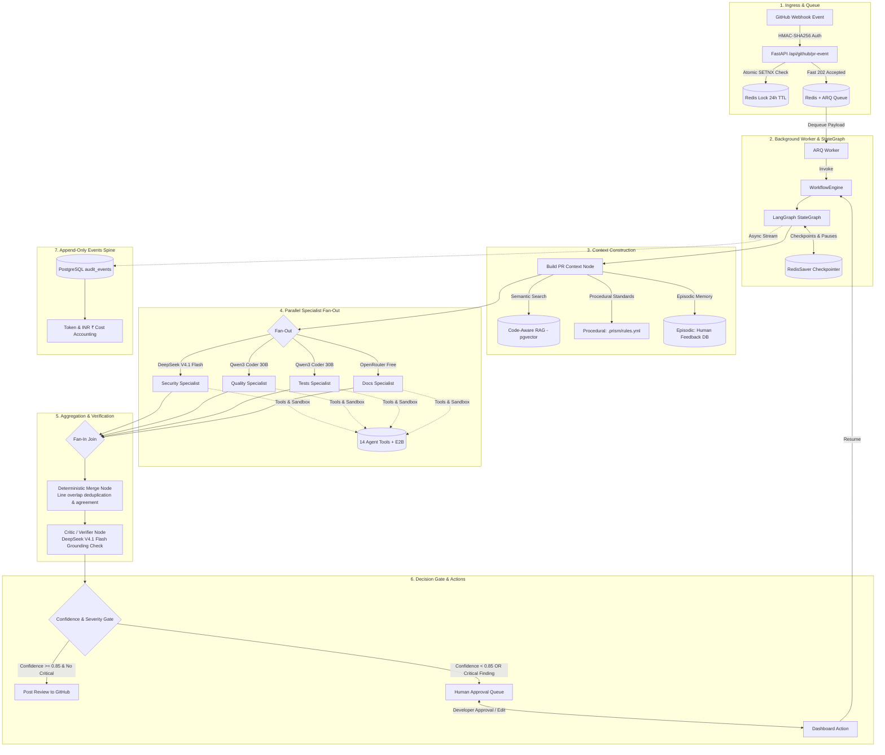

# PRism — AI Engine & Code-Aware RAG (`ai/`)

The **AI Engine** is a high-performance Python service built with **FastAPI**, **LangGraph**, **ARQ + Redis**, **Pydantic v2**, **pgvector**, **LangChain Splitters**, **E2B Sandboxes**, and **OpenRouter / AICredits**. It serves as the primary intelligence layer for PRism, executing deep repository indexing, context-aware semantic retrieval, tool calling, cloud sandboxed execution, and structured automated multi-agent code reviews.

---

## Architecture & Subsystems

```text
ai/
├── app/
│   ├── main.py                # FastAPI server, lifespan DB pools & /api/github/pr-event ingress
│   ├── config.py              # Typed environment settings (pydantic-settings)
│   ├── models/                # Pydantic v2 schemas for GitHub webhooks & reviews
│   │   ├── github.py          # PREventPayload, RepositoryInfo, PullRequestInfo
│   │   └── review.py          # Finding, ReviewResponse, ReviewRequest schemas
│   ├── queue/                 # Asynchronous Redis Ingress & Worker Layer
│   │   ├── redis.py           # Redis connection pool & atomic idempotency helper (SETNX)
│   │   ├── enqueue.py         # Non-blocking job dispatcher for ARQ queue
│   │   └── worker.py          # ARQ worker process executing review workflows
│   ├── workflow/              # Multi-Agent Review Orchestration Engine (LangGraph)
│   │   ├── state.py           # Typed immutable ReviewState & SpecialistOutput schemas
│   │   ├── graph.py           # StateGraph definition: fan-out, fan-in join, decision gates
│   │   ├── checkpointer.py    # Redis/PostgreSQL state checkpointer for HITL pauses
│   │   ├── workflow_engine.py # WorkflowEngine abstract protocol
│   │   ├── langgraph_engine.py# Production LangGraph implementation with checkpointing
│   │   ├── resilience.py      # Circuit breakers, exponential backoffs, and token fallbacks
│   │   ├── agents/            # Domain Specialist Review Agents
│   │   │   ├── base.py        # BaseSpecialistAgent (budgeting, tools, fallback handling)
│   │   │   ├── security.py    # Security specialist (DeepSeek V4.1 Flash)
│   │   │   ├── quality.py     # Quality specialist (Qwen3 Coder 30B)
│   │   │   ├── tests.py       # Tests specialist (Qwen3 Coder 30B + E2B sandbox)
│   │   │   └── docs.py        # Docs specialist (OpenRouter Free)
│   │   ├── memory/            # Tri-Partite Context Memory System
│   │   │   ├── procedural.py  # Repository rules loader (.prism/rules.yml & built-in standards)
│   │   │   └── episodic.py    # Historical accepted/dismissed feedback search (pgvector)
│   │   ├── nodes/             # LangGraph State Machine Nodes
│   │   │   ├── build_context.py # Aggregates semantic, procedural & episodic context
│   │   │   ├── specialists.py # Parallel execution wrappers for 4 specialists
│   │   │   ├── merge.py       # Deterministic deduplication & agreement scoring
│   │   │   ├── critic.py      # Anti-hallucination verification against retrieved code
│   │   │   ├── gate.py        # Confidence & severity routing gate
│   │   │   └── post.py        # Markdown formatting & GitHub comment posting
│   │   └── events/            # Append-Only Telemetry & Cost Accounting
│   │       ├── spine.py       # EventsSpine: persists audit spans into PostgreSQL
│   │       └── cost.py        # Exact token-to-INR (₹) pricing calculator per model tier
│   ├── rag/                   # Code-Aware Retrieval-Augmented Generation Subsystem
│   │   ├── db.py              # Async connection pool (asyncpg) & HNSW pgvector DDL
│   │   ├── models.py          # RAG schemas (CodeChunk, RetrievedChunk, QARequest, etc.)
│   │   ├── ingestion/         # Git snapshot fetcher & filtering (<1MB, <20k tokens)
│   │   ├── chunking/          # AST language splitters + JSON/CSS/YAML/SQL separators
│   │   ├── embeddings/        # AICredits batch embedding client (1536 dimensions)
│   │   ├── vectorstore/       # Strict repository-scoped pgvector cosine similarity search
│   │   ├── retrieval/         # Top-K retrieval coordinator
│   │   ├── indexing/          # Non-blocking async background full/incremental indexer
│   │   └── qa/                # Context-grounded codebase Q&A service
│   ├── tools/                 # Agent Tool Calling Layer (14 Registered Tools)
│   │   ├── base.py            # BaseTool ABC & standardized ToolResult schema
│   │   ├── context.py         # ToolContext (repository, commit SHA, PR number, tokens)
│   │   ├── registry.py        # Central ToolRegistry & OpenAI schema generator
│   │   ├── github/            # PR metadata, diffs, changed files tools
│   │   ├── code/              # read_file, search_codebase, find_references, get_related_tests
│   │   ├── history/           # get_git_history, get_file_history, get_blame
│   │   ├── web/               # web_search, fetch_webpage (with SSRF protection)
│   │   └── tests/             # run_tests, run_linter (agent-facing sandbox wrappers)
│   ├── sandbox/               # Multi-Language E2B Sandbox Execution Service
│   │   ├── models.py          # SandboxRequest, SandboxResult, FilePayload / SandboxFile
│   │   ├── validator.py       # Strict path traversal & payload size validator
│   │   ├── detector.py        # Priority-based project detector & command resolver
│   │   ├── service.py         # SandboxExecutorService (lifecycle, execution & cleanup)
│   │   └── runtimes/          # Extensible language adapters (Python, JS, TS, C++, Java, Go)
│   └── services/              # LLM & Model Router Integrations
│       ├── llm.py             # OpenRouter client & structured JSON output parser
│       └── model_router.py    # Tiered client router & dynamic credit fallback resolver
├── sandbox/                   # E2B Container Definition & Smoke Tests
│   ├── e2b.Dockerfile         # Multi-language custom sandbox image
│   ├── multi_lang_smoke_test.py # Live multi-language cloud verification script
│   └── smoke_test.py          # Baseline E2B connectivity test
└── tests/                     # Automated Test Suite (Pytest: 54 Tests)
    ├── test_events_spine.py   # Cost accounting (INR ₹) & audit event emission tests
    ├── test_memory_and_context.py # Procedural rules & episodic feedback tests
    ├── test_merge_and_critic.py   # Deduplication & critic verifier tests
    ├── test_queue_ingress.py  # Redis idempotency, fast 202 & ARQ worker tests
    ├── test_rag.py            # Chunking, AST splitting & filtering tests
    ├── test_resilience_fallback.py # Credit exhaustion & dynamic model fallback tests
    ├── test_sandbox_detector.py # Path security & language detection unit tests
    ├── test_sandbox_tools.py  # Sandbox tool delegation & passthrough tests
    ├── test_specialists.py    # Multi-turn specialist agent execution tests
    ├── test_tools.py          # Tool execution, schemas & SSRF protection tests
    ├── test_workflow_engine.py# Full mock-to-end review workflow tests
    ├── test_workflow_graph.py # LangGraph routing & topology compilation tests
    └── test_workflow_state.py # ReviewState reducer & data model tests
```

---

## Multi-Agent Review Orchestration

The core review engine executes an asynchronous, stateful, multi-agent graph with end-to-end operational resilience:



### 1. Ingress, Idempotency & Queue (`app/queue/`)
- **Zero-Blocking Ingress:** Webhook deliveries are authenticated with HMAC-SHA256 and enqueued to ARQ within `<50ms`, returning an immediate HTTP `202 Accepted`.
- **Atomic Idempotency:** Redis `SETNX` on `idempotency:github:{delivery_id}` with a 24-hour TTL guarantees no duplicate reviews are triggered on webhook retries.
- **Worker Execution:** Background ARQ workers pick up jobs and invoke the `WorkflowEngine` without blocking API request threads.

### 2. Tri-Partite Memory & Context Building (`app/workflow/memory/` & `nodes/build_context.py`)
Before any specialist executes, the context node gathers:
- **Semantic Memory:** Queries Code-Aware RAG for repository symbols and dependencies outside the immediate PR diff.
- **Procedural Memory:** Loads custom team rules from `.prism/rules.yml` or `.prism/rules.md`, with automatic fallbacks to built-in clean code, security (OWASP), and testing standards.
- **Episodic Memory:** Retrieves historically accepted or dismissed findings for the repository to prevent repeating false positives.

### 3. Tiered Model Routing & Parallel Specialists (`app/workflow/agents/` & `services/model_router.py`)
Agents run concurrently with tiered models and automatic fallback to free tiers on credit exhaustion:

| Specialist | Default Model Tier | Primary Focus | Tools Used |
| :--- | :--- | :--- | :--- |
| **Security Agent** | `deepseek/deepseek-v4.1-flash` | OWASP Top 10, auth flaws, injection, secret leaks | `read_file`, `search_codebase`, `fetch_webpage` |
| **Quality Agent** | `qwen/qwen3-coder-30b-a3b-instruct` | Code architecture, anti-patterns, performance, dead code | `read_file`, `find_references`, `get_blame` |
| **Tests Agent** | `qwen/qwen3-coder-30b-a3b-instruct` | Regression risks, test coverage, sandbox verification | `read_file`, `get_related_tests`, `run_tests`, `run_linter` |
| **Docs Agent** | `openrouter/free` | API contracts, docstrings, breaking changes | `read_file`, `get_pr_diff`, `web_search` |

### 4. Deterministic Merge & Critic Verification (`nodes/merge.py` & `nodes/critic.py`)
- **Deterministic Merge:** Merges findings sharing the same file and overlapping line ranges. Computes `agreement_count` across specialists and synthesizes descriptions without extra LLM round-trips.
- **Critic Verification:** Uses the high-reasoning model to verify each merged finding against the exact code snippet. It rejects hallucinated claims, reduces false positives, and assigns calibrated confidence scores.

### 5. Confidence Gate & Human-in-the-Loop (`nodes/gate.py` & `nodes/post.py`)
- **Auto-Post Path:** Findings with confidence $\ge 0.85$ and no `CRITICAL` severity format a clean markdown review and post directly to the GitHub PR.
- **Human Approval Path:** Reviews with `CRITICAL` findings or confidence $< 0.85$ route to the Human Approval Queue, pausing the LangGraph state checkpoint in Redis until approved or edited via the Next.js dashboard.

### 6. Append-Only Events Spine & INR Cost Accounting (`app/workflow/events/`)
- **`EventsSpine`:** Records structured, immutable audit spans (`AuditEvent`) into PostgreSQL for complete operational traceability.
- **`CostCalculator`:** Calculates token expenditure in Indian Rupees (₹) using exact model rates:
  - `deepseek/deepseek-v4.1-flash`: Input ₹15.10 / 1M, Output ₹60.40 / 1M
  - `qwen/qwen3-coder-30b-a3b-instruct`: Input ₹7.05 / 1M, Output ₹27.18 / 1M
  - `openrouter/free`: ₹0.00 / 1M

---

## Agent Tool Calling Layer

PRism equips review agents with 14 purpose-built tools across 5 key investigation domains. All tools inherit from [`BaseTool`](file:///Users/arindas/Coding/Projects/PRism/ai/app/tools/base.py), enforce Pydantic input validation, and export OpenAI-compatible function-calling specifications via [`ToolRegistry`](file:///Users/arindas/Coding/Projects/PRism/ai/app/tools/registry.py).

### Registered Tools (14 Tools across 5 Domains)

| Domain | Tool Name | Description | Key Guardrails |
| :--- | :--- | :--- | :--- |
| **GitHub PR** | `get_pr_metadata` | Fetches PR title, description, branches, commits, and author. | Requires valid repository context. |
| | `get_pr_diff` | Retrieves unified git patches for all modified PR files. | Scoped to active PR review context. |
| | `get_changed_files` | Returns concise list of changed files with addition/deletion counts. | Scoped to active PR review context. |
| **Code & Repo** | `read_file` | Reads source code at exact commit ref with 1-based line slicing. | Prevents path traversal (`..`), 500KB cap. |
| | `search_codebase` | Performs semantic or exact text search across repository embeddings. | Strict repository scoping (`WHERE repo_name = $2`). |
| | `find_references` | Locates symbol definitions, imports, and usages across the repo. | Language-aware symbol extraction. |
| | `get_related_tests` | Discovers test files and test suites covering target modules. | Test naming patterns + symbol referencing. |
| **Git History** | `get_git_history` | Inspects recent commits, messages, authors, and SHAs on branches. | GitHub API rate-limit resilience. |
| | `get_file_history` | Retrieves commit timeline and changes for a specific file. | Path normalization and branch ref validation. |
| | `get_blame` | Line-by-line blame showing commit SHA, author, and date. | 1-based line range validation. |
| **Web & Docs** | `web_search` | Queries external documentation, breaking changes, and CVEs. | Sanitized search queries via DuckDuckGo. |
| | `fetch_webpage` | Fetches and parses external documentation to clean markdown. | **SSRF Protection**: Blocks private, internal, loopback, link-local, and cloud metadata IPs. |
| **Sandbox Exec** | `run_tests` | Executes repository test suites in an isolated E2B cloud sandbox. | Predefined allowlisted test command, no raw shell access. |
| | `run_linter` | Executes repository code linters and static checks in E2B. | Predefined allowlisted lint command, no raw shell access. |

### Tool Security & Guardrails
1. **SSRF Protection (`app/tools/web/fetch.py`):** Resolves target hostnames via DNS and blocks private/loopback IP ranges (RFC 1918 `10.0.0.0/8`, `172.16.0.0/12`, `192.168.0.0/16`, `127.0.0.0/8`), link-local IPs (`169.254.0.0/16`), cloud metadata endpoints (`169.254.169.254`, `metadata.google.internal`), and non-HTTP schemes (`file://`, `ftp://`).
2. **Context Integrity (`app/tools/context.py`):** Tools require a validated `ToolContext` instance carrying the active repository, commit SHA, and PR number.

---

## Multi-Language E2B Sandbox Executor

PRism uses a custom cloud sandbox environment powered by **E2B** (`prism-polyglot-reviewer`) to execute dynamic tests, linters, and type-checkers on untrusted code safely.

### Sandbox Architecture & Security Lifecycle

```text
1. Agent Request (Files + Operation: TEST / LINT / TYPECHECK)
       │
       ▼
2. Path & Payload Validator (app/sandbox/validator.py)
   • Rejects path traversal ('..'), absolute paths, null bytes
   • Blocks sensitive files (.env, .git, .ssh, .aws)
   • Enforces file count (≤500) and payload size limits (≤2MB/file, ≤10MB total)
       │
       ▼
3. Runtime Detector & Command Resolver (app/sandbox/detector.py)
   • Priority-based detection across registered adapters
   • Resolves ONLY allowlisted commands — never accepts arbitrary shell strings
   • Early exit for unsupported runtimes without starting sandboxes (saves cost)
       │
       ▼
4. Fresh Sandbox Provisioning (app/sandbox/service.py)
   • Spawns fresh E2B container instance (prism-polyglot-reviewer)
   • Populates workspace files at /home/user/workspace
       │
       ▼
5. Controlled Execution & Telemetry
   • Runs allowlisted command with strict execution timeout
   • Captures stdout, stderr, exit code, and duration_ms
       │
       ▼
6. Guaranteed Teardown
   • Unconditionally kills/closes the sandbox in finally: block
```

### Supported Polyglot Runtimes & Operations

| Runtime | Priority | Detection Rules | `TEST` Command | `LINT` Command | `TYPECHECK` Command |
| :--- | :---: | :--- | :--- | :--- | :--- |
| **TypeScript** | 10 | `tsconfig.json`, `*.ts`, `*.tsx` | `npm test` | `npm run lint` | `tsc --noEmit` |
| **JavaScript** | 5 | `package.json`, `*.js`, `*.mjs`, `*.cjs` | `npm test` / `node --test` | `npm run lint` | `npm run typecheck` |
| **Go** | 4 | `go.mod`, `go.sum`, `*.go` | `go test -v ./...` | `go vet ./...` | `go build ./...` |
| **Java** | 3 | `pom.xml`, `build.gradle`, `*.java` | `mvn test -B` / `./gradlew test` | `mvn checkstyle:check` / `javac -Xlint` | `mvn test-compile -B` / `javac` |
| **C / C++** | 3 | `CMakeLists.txt`, `Makefile`, `*.cpp`, `*.c` | `ctest` / `make test` / `g++ *.cpp` | `clang-tidy <files>` | `g++ -fsyntax-only` |
| **Python** | 1 | `pyproject.toml`, `requirements.txt`, `*.py` | `pytest` | `ruff check .` | `ruff check .` |

---

## Code-Aware RAG Pipeline

```text
[Repository / Git Tree]
          │
          ▼
   1. ingestion/          --> Excludes .git, node_modules, binaries (.png, .wasm), >1MB, >20k tokens
          │
          ▼
   2. chunking/           --> AST-aware splitting (Python, TS, Go, Rust, Java, C++, etc.)
          │                   + structural JSON, CSS, SCSS, YAML, SQL, Shell separators
          ▼
   3. embeddings/         --> Batched vector generation via AICredits (openai/text-embedding-3-small)
          │
          ▼
   4. vectorstore/        --> Neon PostgreSQL pgvector with HNSW index (vector_cosine_ops)
          │                   Strict WHERE repo_name = :repo_name scoping on all queries
          ▼
   5. qa/ & retrieval/    --> Injects top-K semantic context into OpenRouter LLM prompts
```

---

## Configuration & Environment Variables

Environment variables are validated via `pydantic-settings` in [`app/config.py`](file:///Users/arindas/Coding/Projects/PRism/ai/app/config.py).

Copy `ai/.env.example` to `ai/.env`:

```bash
cp .env.example .env
```

| Variable | Default | Description |
| :--- | :--- | :--- |
| `OPENROUTER_API_KEY` | *(Required)* | Your OpenRouter API key. |
| `OPENROUTER_MODEL` | `openrouter/free` | Target fallback model ID. |
| `OPENROUTER_BASE_URL` | `https://openrouter.ai/api/v1` | Base URL for OpenRouter API completions. |
| `AICREDITS_API_KEY` | *(Required for RAG/High Models)* | Your AICredits API key. |
| `AICREDITS_BASE_URL` | `https://api.aicredits.in/v1` | Base URL for AICredits API. |
| `AICREDITS_HIGH_MODEL` | `deepseek/deepseek-v4.1-flash` | High-reasoning model for Security & Critic. |
| `AICREDITS_MID_MODEL` | `qwen/qwen3-coder-30b-a3b-instruct` | Mid-tier model for Quality & Tests agents. |
| `EMBEDDING_MODEL` | `openai/text-embedding-3-small` | 1536-dimensional embedding model identifier. |
| `DATABASE_URL` | *(Required for RAG/Audit)* | Neon PostgreSQL connection string with pgvector enabled. |
| `REDIS_URL` | `redis://localhost:6379/0` | Redis instance for ARQ queue and review checkpoints. |
| `E2B_API_KEY` | *(Required for Sandbox)* | Your E2B API key from [e2b.dev](https://e2b.dev). |
| `E2B_TEMPLATE` | `prism-polyglot-reviewer` | Custom E2B sandbox template name or template ID. |
| `NEXTJS_URL` | `http://localhost:5050` | Allowed origin for Next.js frontend and webhook gateway. |

---

## Testing & Verification

```bash
# 1. Activate Python virtual environment
source .venv/bin/activate

# 2. Run the entire automated test suite (54 Tests: Workflow Engine, Memory, Critic, RAG, Tools, Sandbox)
pytest tests/ -v

# 3. Run individual subsystem test suites
pytest tests/test_workflow_engine.py -v     # Full workflow mock execution
pytest tests/test_merge_and_critic.py -v    # Deduplication and critic gate
pytest tests/test_queue_ingress.py -v       # Redis idempotency & ARQ worker
pytest tests/test_events_spine.py -v        # INR cost calculations & audit spine

# 4. Run the live multi-language E2B cloud smoke test
python sandbox/multi_lang_smoke_test.py
```
